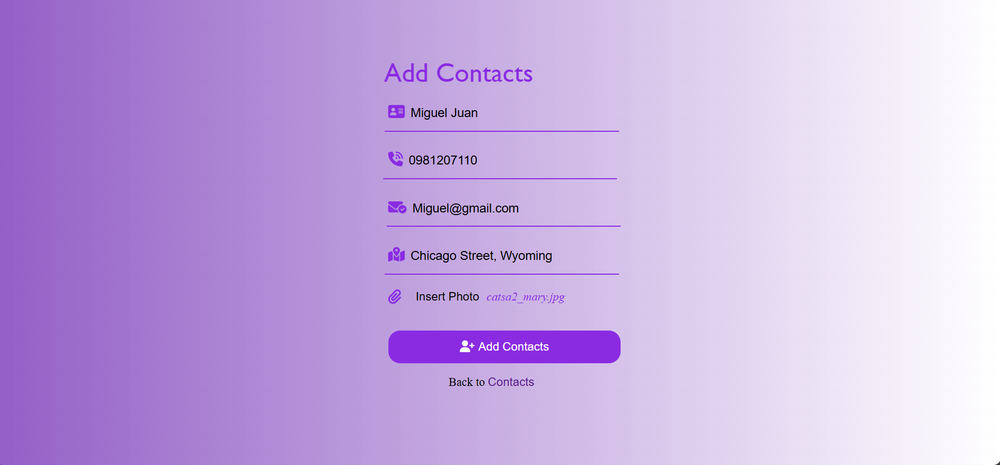
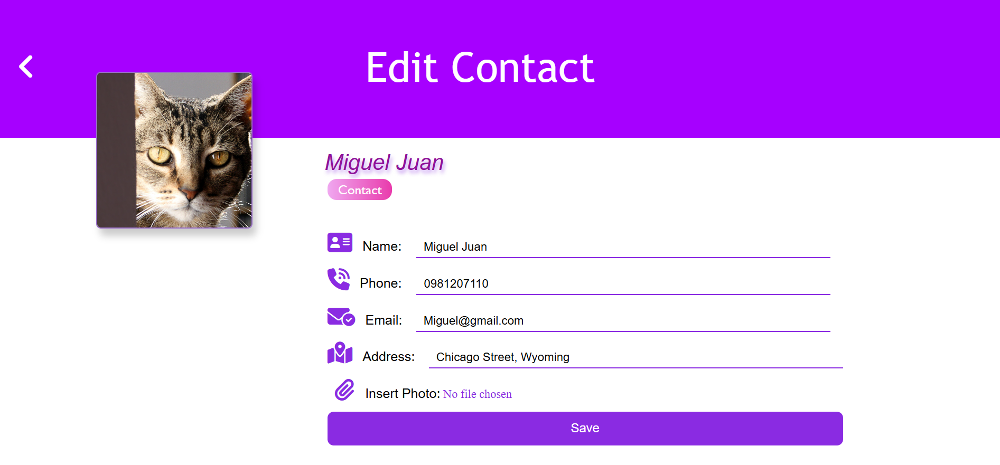

# 📇 Contact List App

Welcome to the **Contact List App** – your all-in-one solution for organizing and managing your personal and professional network with ease!

This web-based application allows users to **create an account**, **store important contact details**, and **manage them all in one place**. Whether you're connecting with friends, colleagues, or new contacts, this app helps keep everyone just a click away!

### 🌟 Key Features

- 🔐 **Secure Sign-Up and Login**  
  Create your own account to securely manage your contact book.

- 👥 **Add New Contacts**  
  Add friends or colleagues by entering their phone number, email, address, and even uploading their profile photo.

- 🧾 **Display Your Contact List**  
  View all saved contacts in a clean and organized format.

- ✏️ **Edit or Update Contacts**  
  Need to update your contact’s info or upload a new image? You can easily do it directly within the app.

- 🖼️ **Update Your Profile Picture**  
  Customize your account by uploading your own profile photo.

- 🔎 **Search by Phone Number**  
  Quickly find the contact you're looking for using the built-in search feature.

---

This app is perfect for students, professionals, or anyone who needs a simple and elegant way to maintain their contact database.

> 💡 Powered by **Flask**, **SQLite**, **HTML/CSS**, **JavaScript**, **Python**, and **Jinja2 Templates**.

=> LOGIN PAGE 🖋️
  🔐 Already part of the circle? Log in and access your contact world!
  🆕 First time here? No worries — Sign up in seconds and start building your network.
  Because every connection matters. 📇✨

=> CONTACT LIST PAGE 📒
  📇 Your Contact Hub
  View your connections at a glance — names, numbers, emails, addresses, and even their photos!

=> ➕ Add Contact
  Meet someone new? Quickly add them to your digital Rolodex!
  Just fill in their info, snap or upload a photo, and boom — they're in your contact circle.
  Building your network has never been this seamless! 💼📸

=> ✏️ Edit Contact
  Need to update a number, fix a typo, or change a profile picture? No worries!
  Easily edit any contact’s information and keep everything up to date — just like that.
  Because staying current is key 🔁📱

  
